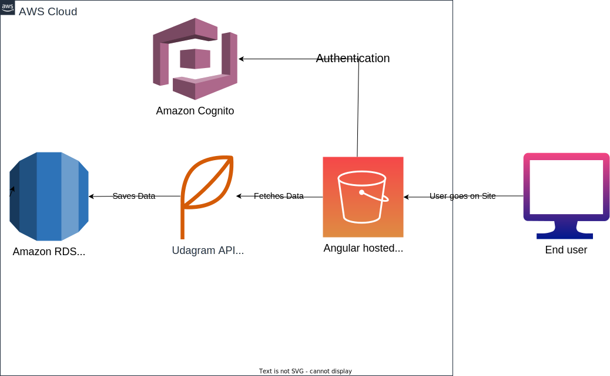

[!Alt text](./udagram-aws-architecture-diagram.drawio.svg)

# Postgres Database

    - hosted on AWS RDS
    - database endpoint:

`database-1.c9yipu3gzpbi.us-east-1.rds.amazonaws.com`

# Backend Environment

    - hosted on AWS Elastic Beanstalk
    - url:

`udagram-api-env.eba-drrpk9bi.us-east-1.elasticbeanstalk.com`

# Frontend Hosting

    - hosted on S3 Static website hosting
    - Bucket website endpoint:

`http://myawsbucket864662948199.s3-website-us-east-1.amazonaws.com`
